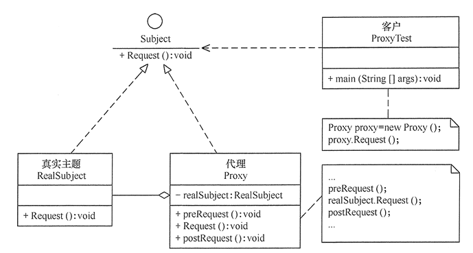
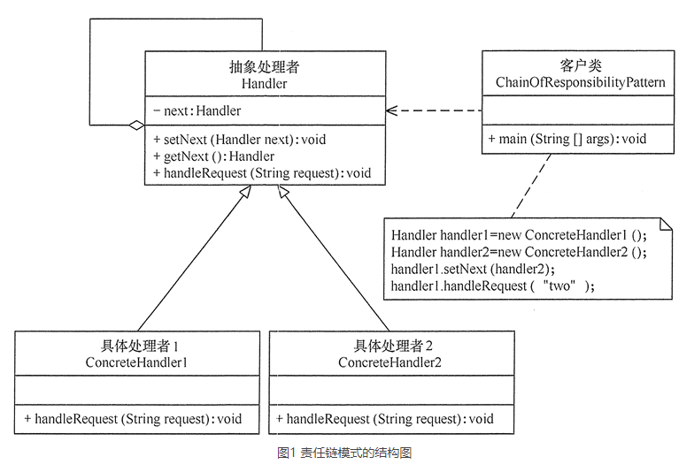
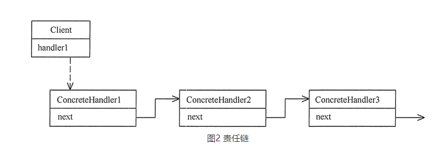
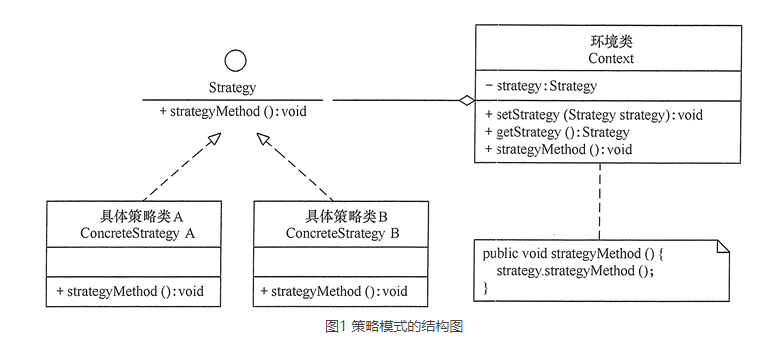
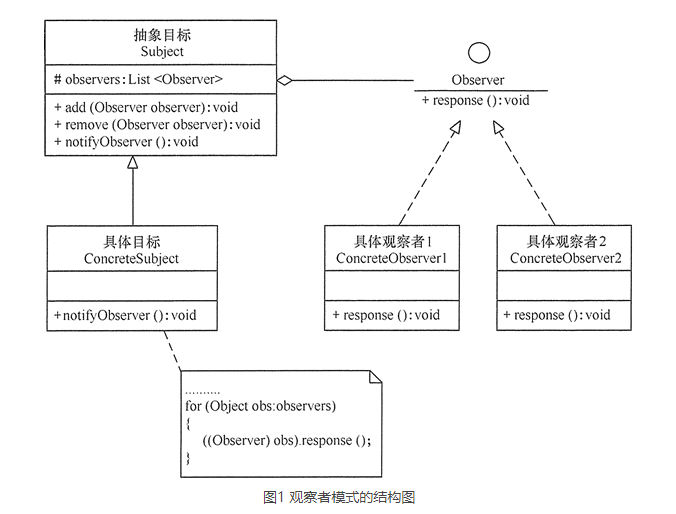
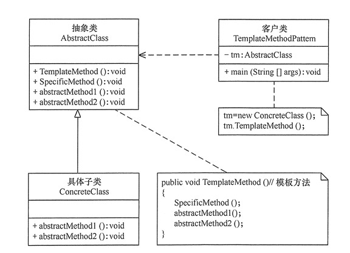

# 设计模式
### 代理模式 
#### 1. 代理模式的定义
代理模式的定义: 由于某些原因需要给某对象提供一个代理以控制对该对象的访问. 这时, 访问对象不适合或者不能直接引用目标对象, 代理对象作为访问对象和目标之间的中介.

代理模式的主要优点有: 
- 代理模式在客户端与目标对象之间起到一个中介作用和保护目标对象的作用
- 代理对象可以扩展目标对象的功能
- 代理模式能将客户端与目标对象分离, 在一定程度上降低了系统的耦合度

主要缺点:  
- 在客户端和目标对象之间增加了一个代理对象, 会造成请求处理速度变慢
- 增加了系统的复杂度  
#### 2. 代理模式的结构与实现  
- 1 抽象主题类(Subject): 通过接口或抽象类声明真实主题和代理对象实现的业务方法
- 2 真实主题类(Real Subject): 实现了抽象主题中的具体业务, 是代理对象所代表的真实对象, 是最终引用的对象
- 3 代理类(Proxy): 提供了与真实主题相同的接口, 其内部含有对真实主题的引用, 它可以访问, 控制或扩展真实主题的功能  

  

#### 3. 代理模式的应用场景  
- 远程代理: 为了隐藏目标对象存在于不同地址空间的事实, 方便客户端访问. ex: 用户申请某些网盘空间时, 会在用户的文件系统中建立一个虚拟的硬盘, 用户访问虚拟硬盘时实际访问的是网盘空间.
- 延迟加载: 为了提高系统的性能, 延迟对目标的加载. ex: `Hibernate`中就存在属性的延迟加载和关联表的延时加载.
- 安全代理: 用于控制不同种类客户对于真实对象的访问权限  
- Spring中的应用: `AOP`动态代理

--- 
### 责任链模式(职责链)
#### 1. 责任链定义与特点
定义:  
为了避免请求发送者与多个请求处理者耦合在一起,将所有请求的处理者通过前一对象记住其下一个对象的引用而连成一条链;当有请求发生时, 可将请求沿着这条链传递, 直到有对象处理它为止.  
在责任链模式中, 客户只需要将请求发送到责任链上即可, 无须关心请求的处理细节和请求的传递过程, 所以责任链将请求的方法者和处理者解耦了.
  
优点: 
- 1 降低了对象之间的耦合度. 该模式是的一个对象无须知道是哪一个对象处理其请求以及链的结构, 发送者和接收者也无须拥有对方的明确信息.  
- 2 增强了系统的可扩展性. 可以根据需要增加新的请求处理类, 满足开闭原则.  
- 3 增强了给对象指派职责的灵活性. 当工作流程发生变化, 可以动态地改变链内的成员或者调动他们的次序, 也可以动态地新增或者删除责任. 
- 4 简化了对象之间的链接. 每个对象只需要保持一个指向其后继者的引用, 不需保持其他所有处理者的引用, 这避免了使用众多的if或者if..else语句.  
- 5 责任分担, 每个类只需要处理自己该处理的工作,不该处理的传递给下一个对象完成,明确各类的责任范围, 符合类的单一职责原则.  

缺点: 
- 1 不能保证每个请求一定被处理. 由于一个请求没有明确的接收者, 所以不能保证它一定会被处理, 该请求可能一直传到链的末端都得不到处理.
- 2 对比较长的职责链, 请求的处理可能涉及多个处理对象, 系统性能将受到一定影响.
- 3 职责链简历的合理性要靠客户端来保证, 增加了客户端的复杂性,可能会由于职责链的错误设置而导致系统出错.ex: 可能会造成循环调用.

#### 2. 模式的结构与实现  
- 模式的结构  
>- 抽象处理者(Handler): 定义一个处理请求的接口, 包含抽象处理方法和一个后继连接.  
>- 具体处理者(Concrete Handler): 实现抽象处理者的处理方法, 判断能否处理本次请求, 如果可以处理请求则处理, 否则将该请求转给它的后继者.  
  
 
- 模式的实现  
```java
package com.xsm.design.pattern.chain.responsibility;

/**
 * @author xsm
 * @Date 2020/6/21 15:16
 * 责任链模式
 */
public class ChainOfResponsibilityPattern {

    public static void main(String[] args) {
        // 组装责任链
        Handler handler1 = new ConcreteHandler1();
        Handler handler2 = new ConcreteHandler2();
        handler1.setNext(handler2);
        // 提交请求
        handler1.handleRequest("two");
    }

}

/**
 * 抽象处理者角色
 */
abstract class Handler {
    private Handler next;

    public void setNext(Handler next) {
        this.next = next;
    }

    public Handler getNext() {
        return next;
    }

    /**
     * 处理请求的方法
     *
     * @param request
     */
    public abstract void handleRequest(String request);
}

/**
 * 具体处理者角色1
 */
class ConcreteHandler1 extends Handler {

    @Override
    public void handleRequest(String request) {
        if ("one".equals(request)) {
            System.out.println("具体处理这1负责处理该请求!");
        }
        else {
            if (getNext() != null) {
                getNext().handleRequest(request);
            }
            else {
                System.out.println("没有人处理该请求!");
            }
        }
    }
}

/** 具体处理者角色2*/
class ConcreteHandler2 extends Handler {

    @Override
    public void handleRequest(String request) {
        if ("two".equals(request)) {
            System.out.println("具体处理者2负责处理该请求！");
        }
        else {
            if (getNext() != null) {
                getNext().handleRequest(request);
            }
            else {
                System.out.println("没有人处理该请求！");
            }
        }
    }
}

```   
- 模式模拟案例 
`com.xsm.design.pattern.chain.responsibility.example.LeaveApprovalTest`

- 模式的应用场景 
>- 1 有多个对象可以处理一个请求, 哪个对象处理该请求由运行时刻自动确定. 
>- 2 可动态指定一组对象处理请求, 或添加新的处理者.  
>- 在不明确指定请求处理者的情况下, 向多个处理者中的一个提交请求.
---
#### 策略模式  
##### 1 策略模式的定义与特点  
定义:  
该模式定义了一系列算法, 并将每个算法封装起来, 使他们可以相互替换, 且算法的变化不会影响使用算法的用户. 策略模式属于对象行为模式, 它通过对算法进行封装, 吧使用算法的责任和算法的实现分割开来, 并委派给不同的对象对这些算法进行管理.
  
优点:  
- 1 多重条件语句不易维护, 而使用策略模式可以避免使用多重条件语句  
- 2 提供了一系列的可供重用的算法族, 恰当使用继承可以把算法的公共代码转移到父类里面, 从而避免重复的代码  
- 3 可以提供相同行为的不同实现, 客户可以根据不同时间或空间要求选择不同的实现.  
- 4 提供了对开闭原则完美的支持, 可以在不修改源代码的情况下, 灵活增加新算法.

缺点: 
- 1 客户端必须理解所有策略算法的区别, 以便适时选择恰当的算法类  
- 2 策略模式造成了很多策略类  

#### 2 策略模式的结构与实现  
- 模式的结构  
>- 1 抽象策略类(Strategy): 定义了一个公共接口, 各种不同的方式实现了这个接口
>- 2 具体策略类(Concrete Strategy): 实现了抽象策略定义的接口, 提供具体的算法实现.
>- 3 执行类(Context): 持有一个策略类的引用, 最终给客户端调用.

- 模式的实现  
```java
package com.xsm.design.pattern.strategy;

/**
 * @author xsm
 * @Date 2020/6/21 16:20
 */
public class StrategyPattern {
    public static void main(String[] args) {
        Context c = new Context();
        Strategy s = new ConcreteStrategyA();
        c.setStrategy(s);
        c.strategyMethod();
        System.out.println("-----------------");
        s = new ConcreteStrategyB();
        c.setStrategy(s);
        c.strategyMethod();
    }
}

/** 抽象策略类*/
interface Strategy {
    /**
     * 策略方法
     */
     void strategyMethod();
}

/** 具体策略类A*/
class ConcreteStrategyA implements Strategy {
    @Override
    public void strategyMethod() {
        System.out.println("具体策略A的策略方法被访问！");
    }
}

/** 具体策略类B*/
class ConcreteStrategyB implements Strategy {
    @Override
    public void strategyMethod() {
        System.out.println("具体策略B的策略方法被访问！");
    }
}

/** 环境类*/
class Context {
    private Strategy strategy;

    public Strategy getStrategy() {
        return strategy;
    }

    public void setStrategy(Strategy strategy) {
        this.strategy = strategy;
    }

    public void strategyMethod() {
        strategy.strategyMethod();
    }
}

```
 


- 实战  
[短信服务-使用策略模式](http://note.youdao.com/noteshare?id=f8e82a3f178603c236be3982f6f882df&sub=8667D44FA63F47FF98C3F8E6833A1C7F)

--- 
### 观察者模式  
#### 1 观察者模式的定义与特点  
定义:  指多个对象间存在一对多的依赖关系, 当一个对象的状态发生改变时, 所有依赖它的对象都得到通知并被自动更新. 这种模式有时又称作发布-定于模式, 模型-视图模式. 是对象行为型模式.  
优点: 
- 降低了目标与观察者之间的耦合关系, 两者之间是抽象耦合关系.
- 目标与观察者之间建立了一套触发机制  

缺点: 
- 目标与观察者之间的依赖关系并没有完全解除, 而且有可能出现循环引用  
- 当观察者对象很多时, 通知的发布会花费很多时间, 影响程序的效率  

#### 2 结构与实现  
- 结构: 
>- 1 抽象主题(subject): 抽象目标类, 它提供了一个用于保存观察者对象的聚集类和增加, 删除观察者对象的方法, 以及通知所有观察者的抽象方法.  
>- 2 具体主题(Concrete Subject): 也叫具体目标类, 它实现抽象目标中的通知方法, 当具体主题的内部状态发生变化时, 通知所有注册过的观察对象.  
>- 3 抽象观察者(Observer): 是一个抽象类或接口, 它包含了一个更新自己的抽象方法, 当接到具体主题的更改通知时被调用.  
>- 4 具体观察者(Concrete Observer): 实现抽象观察者中定义的抽象方法, 以便在得到目标的更改通知时更新自身状态.

 

- 实现
```java
public class ObserverPattern {

    public static void main(String[] args) {
        Subject subject=new ConcreteSubject();
        Observer obs1=new ConcreteObserver1();
        Observer obs2=new ConcreteObserver2();
        subject.add(obs1);
        subject.add(obs2);
        subject.notifyObserver();
    }

}

/**
 * 抽象目标
 */
abstract class Subject {
    protected List<Observer> observers = new ArrayList<Observer>();

    /**
     * 增加观察者方法
     *
     * @param observer
     */
    public void add(Observer observer) {
        observers.add(observer);
    }

    /**
     * 删除观察者方法
     *
     * @param observer
     */
    public void remove(Observer observer) {
        observers.remove(observer);
    }

    /**
     * 通知观察者方法
     */
    public abstract void notifyObserver();
}

/** 具体目标*/
class ConcreteSubject extends Subject {

    @Override
    public void notifyObserver() {
        System.out.println("具体目标发生改变...");
        System.out.println("--------------");

        for (Object obs : observers) {
            ((Observer) obs).response();
        }

    }
}

/** 抽象观察者*/
interface Observer {
    /**
     * 反应
     */
    void response();
}

/** 具体观察者1*/
class ConcreteObserver1 implements Observer {
    @Override
    public void response() {
        System.out.println("具体观察者1作出反应！");
    }
}

/** 具体观察者2*/
class ConcreteObserver2 implements Observer {
    @Override
    public void response() {
        System.out.println("具体观察者2作出反应！");
    }
}
```
---
### 模板方法模式
#### 1 模式的定义和特点
定义:  定义一个操作中的算法骨架, 而将算法的一些步骤延迟到子类中,
是的子类可以不改变该算法结构的情况下重定义该算法的某些特定步骤. 是一种行为型模式

优点:
- 封装了不变部分, 扩展可变部分, 把认为是不变部分的算法封装到父类中实现,
  而把可变部分算法由子类集成实现, 便于子类继续扩展.
- 在父类中提取了公共的部分代码, 便于代码复用.
- 部分方法是由子类实现的, 因此子类可以通过扩展方式增加响应的功能, 符合开闭原则.

缺点:
- 对每个不同的实现都需要定义一个子类, 这会导致类的个数增加, 系统更加庞大,
  设计也更加抽象.
- 父类中的抽象方法由子类实现, 子类执行的结果会影响父类的结果, 导致一种反向的控制结构,
  提高了代码阅读的难度.

#### 2. 模式的结构和实现
1. 结构:
- 抽象类: 负责给出一个算法的轮廓和骨架,
  它由一个模板方法和若干个基本方法构成.方法定义如下:
> - 模板方法: 定义了算法的骨架, 按某种顺序调用其包含的基本方法
> - 基本方法: 是整个算法中的一个步骤, 包含一下几种类型:
> > - 抽象方法: 在抽象类中声明, 由具体子类实现.
> > - 具体方法: 在抽象类中已经实现, 在具体子类中可以继承或重写它.
> > - 钩子放阿飞: 在抽象类中已经实现, 包括用于判断的逻辑方法和需要子类重写的空方法两种

- 具体子类: 实现抽象类中锁定义的抽象方法和钩子方法, 他们是一个顶级逻辑的一个组成步骤

2. 实现


```java
public class TemplateMethodPattern {

    public static void main(String[] args) {
        AbstractClass tm = new ConcreteClass();
        tm.TemplateMethod();
    }
}

/** 抽象类 */
abstract class AbstractClass {

    /**
     * 模板方法
     */
    public void TemplateMethod() {
        SpecificMethod();
        abstractMethod1();
        abstractMethod2();
    }

    /**
     * 具体方法
     */
    public void SpecificMethod() {
        System.out.println("抽象类中的具体方法被调用...");
    }

    /**
     * 抽象方法1
     */
    public abstract void abstractMethod1();

    /**
     * 抽象方法2
     */
    public abstract void abstractMethod2(); 
}

/** 具体子类*/
class ConcreteClass extends AbstractClass {

    @Override
    public void abstractMethod1() {
        System.out.println("抽象方法1的实现被调用...");
    }

    @Override
    public void abstractMethod2() {
        System.out.println("抽象方法2的实现被调用...");
    }
}
```

3. 项目中实战应用

短信服务接入多个第三方短信平台的负载均衡实现
```java
public interface ILoadBalance {

    /**
     * 负载均衡策略接口
     * @param smsPlatformInfoList 配置的短信平台
     * @return 负载均衡选出的短信平台
     */
    String select(List<SmsPlatformInfo> smsPlatformInfoList);

}
```
```java
public abstract class BaseLoadBalance implements ILoadBalance{

    /**
     * 系统配置默认选用的短信平台, 在通过数据库查询不到可用的短信平台时使用
     */
    private String defaultPlatform;

    @Override
    public String select(List<SmsPlatformInfo> smsPlatformList){
        if (CollectionUtils.isEmpty(smsPlatformList)){
            log.error("无短信平台可负载均衡, 使用系统默认的短信平台: {}", defaultPlatform);
            return defaultPlatform;
        }

        if (smsPlatformList.size() == 1){
            return smsPlatformList.get(0).getPlatformName();
        }
        return doSelect(smsPlatformList);
    }

    /**
     * 提供给子类实现不同负载均衡算法
     * @param smsPlatformList 所有配置的短信平台
     * @return 负载均衡选出的短信平台名称
     */
    protected abstract String doSelect(List<SmsPlatformInfo> smsPlatformList);
}
```
```java
/**
 * @author xsm
 * @date 2019/9/7 16:06
 * 权重随机负载均衡策略实现
 */
@Component(value = LoadBalance.RANDOM_LOAD_BALANCE)
@Slf4j
public class RandomLoadBalanceImpl extends BaseLoadBalance {

    private final Random random = new Random();

    @Override
    protected String doSelect(List<SmsPlatformInfo> smsPlatformInfoList) {
        // 总个数
        int length = smsPlatformInfoList.size();
        int totalWeight = 0;
        // 是否所有权重相同
        boolean sameWeight = true;
        for (int i = 0; i < length; i ++){
            int weight = smsPlatformInfoList.get(i).getWeight();
            totalWeight += weight;
            // 判断是否所有短信平台的权重都一致
            if (sameWeight && i > 0 && !Objects.equals(weight, smsPlatformInfoList.get(i - 1).getWeight())){
                sameWeight = false;
            }
        }
        // 如果所有短信平台配置的权重不同, 则进行权重随机
        if (!sameWeight && totalWeight > 0){
            int randomPos = random.nextInt(totalWeight);
            for (SmsPlatformInfo smsPlatformInfo : smsPlatformInfoList) {
                int weight = smsPlatformInfo.getWeight();
                randomPos = randomPos - weight;
                if (randomPos < 0) {
                    return smsPlatformInfo.getPlatformName();
                }
            }
        }
        // 如果权重相同或权重为0, 则均等随机
        return smsPlatformInfoList.get(random.nextInt(length)).getPlatformName();
    }

}
```


 
  


