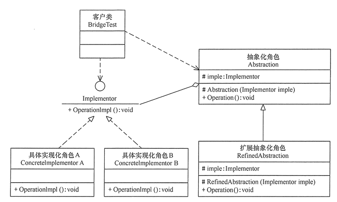
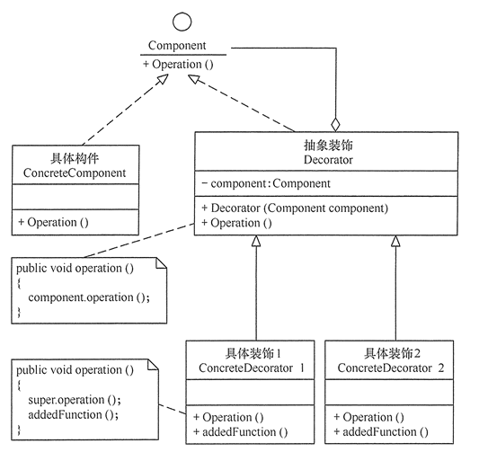
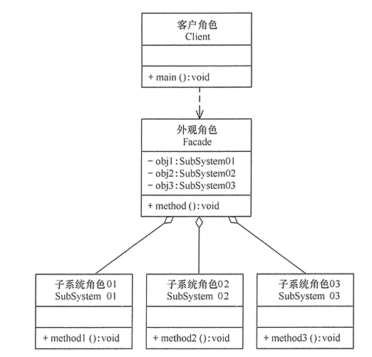
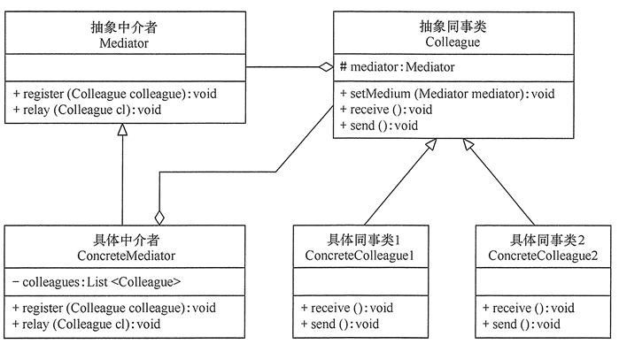

## 设计模式
GOF23种设计模式的学习, 实践

## 目录

- [创建型模式](#创建型模式)
  - [单例模式](#单例模式)
  - [原型模式](#原型模式)
  - [工厂方法模式]()
  - [抽象工厂模式]()
  - [建造者模式]()

- [结构型模式](#结构型模式)
  - [代理模式](#代理模式)
  - [适配器模式](#适配器模式)
  - [桥接模式](#桥接模式)
  - [装饰模式](#装饰模式)
  - [外观模式](#外观模式)
  - [享元模式](#享元模式)
  - [组合模式](#组合模式)

- [行为型模式](#行为型模式)
  - [责任链模式](#责任链模式)
  - [策略模式](#策略模式)
  - [观察者模式](#观察者模式)
  - [模板方法模式](#模板方法模式)
  - [命令模式]()
  - [状态模式]()
  - [中介者模式](#中介者模式)
  - [迭代器模式]()
  - [访问者模式]()
  - [备忘录模式]()
  - [解释器模式]()

- [23种设计模式总结](#23种设计模式总结)
---

## 创建型模式

### 单例模式

定义: 指一个类只有一个实例, 且该类能自行创建这个实例的一种模式


实现

```java
/** 懒汉式单例 DCL双重锁模式*/
public class LazySingleton {
    
    /** 定义单例对象, 类加载并不作初始化操作*/
    private static volatile LazySingleton instance = null;
    
    /** 私有化构造器, 防止 new 对象*/
    private LazySingleton(){}
    
    public static LazySingleton getInstance(){
        if (instance == null) {
            // 加锁
            synchronized (LazySingleton.class) {
                if (instance == null) {
                    instance = new LazySingleton();
                }
            }
        }
        return instance;
    }
}
```

```java
/** 饿汉式单例, 类一旦加载就创建一个单例*/
public class HungrySingleton {
    
    private static final HungrySingleton instance = new HungrySingleton();
    
    private HungrySingleton(){}
    
    public static HungrySingleton getInstance(){
        return instance;
    }

}
```

### 原型模式
定义: 用一个已经创建的实例作为原型,
通过复制该原型对象来创建一个和原型形同或相似的新对象. 在这里,
原型实例指定了要创建的对象的种类. 用这种方式创建对象非常高效

Java中提供`clone()`方法进行对象的复制操作, 但是这里仅仅是浅拷贝

一般项目中进行对象拷贝操作的情况大多用在DTO, VO, PO之间的转换操作, 如使用
BeanUtil进行对象拷贝操作

## 结构型模式

### 代理模式
#### 1. 代理模式的定义
代理模式的定义: 由于某些原因需要给某对象提供一个代理以控制对该对象的访问. 这时, 访问对象不适合或者不能直接引用目标对象, 代理对象作为访问对象和目标之间的中介.

代理模式的主要优点有:
- 代理模式在客户端与目标对象之间起到一个中介作用和保护目标对象的作用
- 代理对象可以扩展目标对象的功能
- 代理模式能将客户端与目标对象分离, 在一定程度上降低了系统的耦合度

主要缺点:
- 在客户端和目标对象之间增加了一个代理对象, 会造成请求处理速度变慢
- 增加了系统的复杂度
#### 2. 代理模式的结构与实现
- 1 抽象主题类(Subject): 通过接口或抽象类声明真实主题和代理对象实现的业务方法
- 2 真实主题类(Real Subject): 实现了抽象主题中的具体业务, 是代理对象所代表的真实对象, 是最终引用的对象
- 3 代理类(Proxy): 提供了与真实主题相同的接口, 其内部含有对真实主题的引用, 它可以访问, 控制或扩展真实主题的功能


#### 3. 代理模式的应用场景
- 远程代理: 为了隐藏目标对象存在于不同地址空间的事实, 方便客户端访问. ex: 用户申请某些网盘空间时, 会在用户的文件系统中建立一个虚拟的硬盘, 用户访问虚拟硬盘时实际访问的是网盘空间.
- 延迟加载: 为了提高系统的性能, 延迟对目标的加载. ex: `Hibernate`中就存在属性的延迟加载和关联表的延时加载.
- 安全代理: 用于控制不同种类客户对于真实对象的访问权限
- Spring中的应用: `AOP`动态代理

---
### 适配器模式
#### 1. 适配器模式定义与特点
定义: 将一个类的接口转换成客户希望的另外一个接口,
使得原本有与接口不兼容而不能一起工作的那些类能一起工作.
适配器模式分为类结构模式和对象结构型模式两种, 前者类之间的耦合度比后者高.

优点:
- 客户端通过适配器可以透明的调用目标接口
- 复用了现存的类, 不需要修改原有代码而重用现有的适配者类
- 将目标类和适配者类解耦, 解决了目标类和适配类接口不一致的问题.

缺点:
- 对类适配器来说, 更换适配器的实现过程比较复杂

#### 2. 模式的结构与实现

结构:
- 目标接口: 当前系统业务所期待的接口, 可以是抽象类或接口
- 适配者类: 它是被访问和适配的现存组件库中的组件接口
- 适配器类: 它是一个转换器, 通过继承或引用适配者对象, 把适配者接口转换成目标接口,
  让客户按目标接口的格式访问适配者.

实现:
- 类适配器模式


```java
package com.xsm.design.pattern;

/**
 * @author xsm
 * @date 2020/07/10
 * @description
 */
/** 目标接口*/
interface Target {

    /**
     * 目标接口方法
     */
    void request();
}

/** 适配者*/
class Adaptee {
    public void specificRequest(){
        System.out.println("适配者中的业务代码被调用!");
    }
}

/** 类适配器*/
class ClassAdapter extends Adaptee implements Target {

    @Override
    public void request() {
        specificRequest();
    }
}

/** 客户端*/
public class ClassAdapterTest {

    public static void main(String[] args) {
        System.out.println("类适配器模式测试");
        Target target = new ClassAdapter();
        target.request();
    }

}

```
- 对象适配器模式


```java
//目标接口
interface Target
{
    public void request();
}
//适配者接口
class Adaptee
{
    public void specificRequest()
    {       
        System.out.println("适配者中的业务代码被调用！");
    }
}
//类适配器类
class ClassAdapter extends Adaptee implements Target
{
    public void request()
    {
        specificRequest();
    }
}
//客户端代码
public class ClassAdapterTest
{
    public static void main(String[] args)
    {
        System.out.println("类适配器模式测试：");
        Target target = new ClassAdapter();
        target.request();
    }
}
```

### 桥接模式
##### 1. 桥接模式的定义与特点  
定义:  
将抽象与实现分离, 使它们可以独立变化. 它是用组合关系代替继承关系来实现, 从而降低了抽象和实现这两个可变唯独的耦合度.  
优点:  
- 由于抽象与实现分离,所以扩展能力强
- 其实现细节对客户端透明  

缺点:  
由于聚合关系建立在抽象层,要求开发者针对抽象化进行设计与编程,这增加了系统的理解与设计难度  

##### 2. 桥接模式的结构与实现  
- 模式的结构  
>- 抽象化角色: 定义抽象类,并包含一个对实现化对象的引用
>- 扩展抽象化角色: 是抽象化角色的子类,实现父类中的业务方法, 并通过组合关系实现化角色中的业务方法
>- 实现化角色: 定义实现化角色的结构,供扩展抽象化角色调用
>- 具体实现化角色: 给出实现化角色接口的具体实现  


- 实现  
```java
public class BridgeTest {
    public static void main(String[] args) {
        Implementor impl = new ConcreteImplementorA();
        Abstraction abs = new RefinedAbstraction(impl);
        abs.Operation();
    }
}

/** 实现化角色*/
interface Implementor {
    void OperationImpl();
}

/** 具体实现化角色*/
class ConcreteImplementorA implements Implementor {

    @Override
    public void OperationImpl() {
        System.out.println("具体实现化(Concrete Implementor)角色被访问");
    }
}

/** 抽象化角色*/
abstract class Abstraction {

    protected Implementor impl;

    public Abstraction(Implementor impl) {
        this.impl = impl;
    }

    public abstract void Operation();
}

/** 扩展抽象化角色*/
class RefinedAbstraction extends Abstraction {

    public RefinedAbstraction(Implementor impl) {
        super(impl);
    }

    @Override
    public void Operation() {
        System.out.println("扩展抽象化(Refined Abstraction)角色被访问");
        impl.OperationImpl();
    }
}
```  

- 桥接模式的应用场景  
>- 当一个类存在两个独立变化的维度,且这两个维度都需要进行扩展时.
>- 当一个系统不希望使用继承或因为多层次继承导致了系统类的个数急剧增加时.
>- 当一个系统需要在构件的抽象化角色和具体化角色之间增加更多的灵活性时.

### 装饰模式  
#### 1. 装饰模式的定义与特点  
定义:  
指在不改变现有对象结构的情况下, 动态地给该对象增加一些职责(即增加额外功能)的模式.  

优点: 
- 采用装饰模式扩展对象的功能比采用继承方式更加灵活
- 可以设计出多个不同的具体装饰类,创造出多个不同行为的组合  

缺点:  
- 装饰模式增加了许多子类,如果过度使用会使程序变得很复杂  

#### 2. 装饰模式的结构与实现  
通常情况下, 扩展一个类的功能会使用继承方式来实现.但继承具有静态特征, 耦合度高,并且随着扩展功能的增多,子类会很膨胀.如果使用组合关系来创建一个包装对象(即装饰对象)来包裹真实对象,并在保持真实对象的类结构不变的前提下,为其提供额外的功能,这就是装饰模式的目标.  

- 结构  
>- 抽象构件: 定义一个抽象接口以规范准备接收附加责任的对象.
>- 具体构件: 实现抽象构件,通过装饰角色为其添加一些职责.
>- 抽象装饰: 继承抽象构件,并包含具体构件的实例,可以通过其子类扩展具体构件的功能.
>- 具体装饰: 实现抽象装饰的相关方法,并给具体构件对象添加附加的责任.  

  

- 实现  

```java

package com.xsm.design.pattern.decorator;

/**
 * @author xsm
 * @Date 2020/7/12 15:05
 * 装饰模式
 */
public class DecoratorPattern {
    public static void main(String[] args) {
        Component p = new ConcreteComponent();
        p.operation();
        System.out.println("---------------------------------");
        Component d = new ConcreteDecorator(p);
        d.operation();
    }
}

/**
 * 抽象构件角色
 */
interface Component {
    void operation();
}

/**
 * 具体构件角色
 */
class ConcreteComponent implements Component {

    public ConcreteComponent() {
        System.out.println("创建具体构件角色");
    }

    @Override
    public void operation() {
        System.out.println("调用具体构件角色的方法operation()");
    }
}

/**
 * 抽象装饰角色
 */
class Decorator implements Component {
    private Component component;

    public Decorator(Component component) {
        this.component = component;
    }

    @Override
    public void operation() {
        component.operation();
    }
}

/**
 * 具体装饰角色
 */
class ConcreteDecorator extends Decorator {

    public ConcreteDecorator(Component component) {
        super(component);
    }

    @Override
    public void operation() {
        super.operation();
        addedFunction();
    }

    /**
     * 需要扩展的功能
     */
    public void addedFunction() {
        System.out.println("为具体构件角色增加额外的功能addedFunction");
    }
}
```

- 装饰模式的应用场景  

>- 当需要给一个现有类添加附加职责,而又不能采用生成子类的方法进行扩充时. ex: 该类被隐藏或者该类是终极类或者采用继承方式会产生大量的子类  
>- 当需要通过对现有的一组基本功能进行排列组合而产生非常多的功能时,采用继承关系很难实现,而采用装饰模式却很好实现.
>- 当对象的功能要求可以动态地添加,也可以再动态地撤销

装饰模式在Java语言中的最著名的应用莫过于Java I/O标准库的设计了.  

### 外观模式  
#### 1. 外端模式的定义与特点  
定义:  
是一种通过多个复杂的子系统提供一个一致的接口,而使这些子系统更加容易被访问的模式.该模式对外有一个统一接口,外部应用程序不用关心内部子系统的具体细节,这样会大大降低应用程序的复杂度,提高了程序的可维护性.  
外观模式是迪米特法则的典型应用  

优点:  
- 降低了子系统与客户端之间的耦合度,使得子系统的变化不会影响调用它的客户类  
- 对客户屏蔽了子系统组件,减少了客户处理的对象数组,并使得子系统使用起来更加容易
- 降低了大型软件系统中的编译依赖性,简化了烯烃在不同平台之间的移植过程,因为编译一个子系统不会影响其他的子烯烃,也不会影响外观对象  

缺点:  
- 不能很好地限制客户使用子系统类  
- 增加新的子烯烃可能需要修改外观类或客户端的源代码,违背了开闭原则  

#### 2. 外观模式的结构与实现  

外观模式的结构比较简单,主要是定义了一个高层接口.它包含对了对各个子系统的引用,客户端可以通过它访问各个子系统的功能  

- 结构  
>- 外观角色: 为多个子系统提供一个共用的接口  
>- 子系统角色: 实现系统的部分功能,客户可以通过外观角色访问它 
>- 客户: 通过一个外观角色访问各个子系统的功能 




- 实现
```java
package com.xsm.design.pattern.facade;

/**
 * @author xsm
 * @Date 2020/7/12 16:38
 * 外观模式
 */
public class FacadePattern {

    public static void main(String[] args) {
        Facade f = new Facade();
        f.method();
    }

}

/**
 * 外观角色
 */
class Facade {
    private SubSystem01 obj1 = new SubSystem01();
    private SubSystem02 obj2 = new SubSystem02();
    private SubSystem03 obj3 = new SubSystem03();

    public void method() {
        obj1.method1();
        obj2.method2();
        obj3.method3();
    }
}

/**
 * 子系统角色
 */
class SubSystem01 {
    public void method1() {
        System.out.println("子系统01的method1()被调用！");
    }
}

/**
 * 子系统角色
 */
class SubSystem02 {
    public void method2() {
        System.out.println("子系统02的method2()被调用！");
    }
}

/**
 * 子系统角色
 */
class SubSystem03 {
    public void method3() {
        System.out.println("子系统03的method3()被调用！");
    }
}

```  

- 外观模式的应用场景  
>- 对分层结构系统构建时,使用外观模式定义子系统中每层的入口点可以简化子系统之间的依赖关系  
>- 当一个复杂系统的子系统很多时,外观模式可以为系统设计一个简单的接口供外界访问.
>- 当客户端与多个子系统之间存在很大的联系时,引入外观模式可将它们分离,从而提高子系统的独立性和可移植性  


### 享元模式
定义:  
运用共享技术来有效地支持大量细粒度对象的复用.它通过共享已经存在的对象大幅度减少需要查创建对象数量,避免大量相似类的开销,从而提高系统资源的利用率.

优点:
- 相同对象只要保存一份,这降低了系统中对象的数量,从而降低了系统中细粒度对象给内存带来的压力

缺点:
- 为了使对象可以共享,需要将一些不能共享的状态外部化,这将增加程序的复杂性
- 读取享元模式的外部状态使得运行时间稍微边长

### 组合模式
#### 1. 组合模式的定义与特点
定义:  
有时又叫部分-整体模式,它是一种对象组合成树状的层次结构的模式,用来表示"部分-整体"的关系,使用户对单个对象和组合对象具有一致的访问性

优点:
- 组合模式使得客户端代码可以一致地处理单个对象和组合对象,无须关心自己处理的是单个对象,还是组合对象,这简化了客户端代码.
- 更容易在组合体内加入新的对象,客户端不会因为加入了新的对象而更改源代码,满足开闭原则

缺点:
- 设计较复杂,客户端需要花更多时间理清类之间的层次关系
- 不容易限制容器中的构件
- 不容易用继承的方法来增加构件的新功能

#### 2. 组合模式的结构与实现

- 结构:
> - 抽象构建角色:
>   它的主要作用是为树叶和树枝构件声明公共接口,并实现他们的默认行为.在透明式的组合模式中抽象构建还声明访问和管理子类的接口;在安全式的组合模式中不声明访问和管理子类的接口,管理工作有树枝构件完成.
> - 树叶构件: 是组合中的叶节点对象, 它没有子节点,用于实现抽象构建角色中声明的公共接口
> - 树枝构件:
>   是组合中的分支节点对象,它有子节点.它实现了抽象构建角色中声明的接口,它的主要作用是存储和管理子部件.


## 行为型模式

### 责任链模式
#### 1. 责任链定义与特点
定义:  
为了避免请求发送者与多个请求处理者耦合在一起,将所有请求的处理者通过前一对象记住其下一个对象的引用而连成一条链;当有请求发生时, 可将请求沿着这条链传递, 直到有对象处理它为止.  
在责任链模式中, 客户只需要将请求发送到责任链上即可, 无须关心请求的处理细节和请求的传递过程, 所以责任链将请求的方法者和处理者解耦了.
  
优点: 
- 1 降低了对象之间的耦合度. 该模式是的一个对象无须知道是哪一个对象处理其请求以及链的结构, 发送者和接收者也无须拥有对方的明确信息.  
- 2 增强了系统的可扩展性. 可以根据需要增加新的请求处理类, 满足开闭原则.  
- 3 增强了给对象指派职责的灵活性. 当工作流程发生变化, 可以动态地改变链内的成员或者调动他们的次序, 也可以动态地新增或者删除责任. 
- 4 简化了对象之间的链接. 每个对象只需要保持一个指向其后继者的引用, 不需保持其他所有处理者的引用, 这避免了使用众多的if或者if..else语句.  
- 5 责任分担, 每个类只需要处理自己该处理的工作,不该处理的传递给下一个对象完成,明确各类的责任范围, 符合类的单一职责原则.  

缺点: 
- 1 不能保证每个请求一定被处理. 由于一个请求没有明确的接收者, 所以不能保证它一定会被处理, 该请求可能一直传到链的末端都得不到处理.
- 2 对比较长的职责链, 请求的处理可能涉及多个处理对象, 系统性能将受到一定影响.
- 3 职责链简历的合理性要靠客户端来保证, 增加了客户端的复杂性,可能会由于职责链的错误设置而导致系统出错.ex: 可能会造成循环调用.

#### 2. 模式的结构与实现  
- 模式的结构  
>- 抽象处理者(Handler): 定义一个处理请求的接口, 包含抽象处理方法和一个后继连接.  
>- 具体处理者(Concrete Handler): 实现抽象处理者的处理方法, 判断能否处理本次请求, 如果可以处理请求则处理, 否则将该请求转给它的后继者.  
  

- 模式的实现  
```java
package com.xsm.design.pattern.chain.responsibility;

/**
 * @author xsm
 * @Date 2020/6/21 15:16
 * 责任链模式
 */
public class ChainOfResponsibilityPattern {

    public static void main(String[] args) {
        // 组装责任链
        Handler handler1 = new ConcreteHandler1();
        Handler handler2 = new ConcreteHandler2();
        handler1.setNext(handler2);
        // 提交请求
        handler1.handleRequest("two");
    }

}

/**
 * 抽象处理者角色
 */
abstract class Handler {
    private Handler next;

    public void setNext(Handler next) {
        this.next = next;
    }

    public Handler getNext() {
        return next;
    }

    /**
     * 处理请求的方法
     *
     * @param request
     */
    public abstract void handleRequest(String request);
}

/**
 * 具体处理者角色1
 */
class ConcreteHandler1 extends Handler {

    @Override
    public void handleRequest(String request) {
        if ("one".equals(request)) {
            System.out.println("具体处理这1负责处理该请求!");
        }
        else {
            if (getNext() != null) {
                getNext().handleRequest(request);
            }
            else {
                System.out.println("没有人处理该请求!");
            }
        }
    }
}

/** 具体处理者角色2*/
class ConcreteHandler2 extends Handler {

    @Override
    public void handleRequest(String request) {
        if ("two".equals(request)) {
            System.out.println("具体处理者2负责处理该请求！");
        }
        else {
            if (getNext() != null) {
                getNext().handleRequest(request);
            }
            else {
                System.out.println("没有人处理该请求！");
            }
        }
    }
}

```   
- 模式模拟案例 
`com.xsm.design.pattern.chain.responsibility.example.LeaveApprovalTest`

- 模式的应用场景 
>- 1 有多个对象可以处理一个请求, 哪个对象处理该请求由运行时刻自动确定. 
>- 2 可动态指定一组对象处理请求, 或添加新的处理者.  
>- 在不明确指定请求处理者的情况下, 向多个处理者中的一个提交请求.
---
### 策略模式
##### 1 策略模式的定义与特点  
定义:  
该模式定义了一系列算法, 并将每个算法封装起来, 使他们可以相互替换, 且算法的变化不会影响使用算法的用户. 策略模式属于对象行为模式, 它通过对算法进行封装, 吧使用算法的责任和算法的实现分割开来, 并委派给不同的对象对这些算法进行管理.
  
优点:  
- 1 多重条件语句不易维护, 而使用策略模式可以避免使用多重条件语句  
- 2 提供了一系列的可供重用的算法族, 恰当使用继承可以把算法的公共代码转移到父类里面, 从而避免重复的代码  
- 3 可以提供相同行为的不同实现, 客户可以根据不同时间或空间要求选择不同的实现.  
- 4 提供了对开闭原则完美的支持, 可以在不修改源代码的情况下, 灵活增加新算法.

缺点: 
- 1 客户端必须理解所有策略算法的区别, 以便适时选择恰当的算法类  
- 2 策略模式造成了很多策略类  

#### 2 策略模式的结构与实现  
- 模式的结构  
>- 1 抽象策略类(Strategy): 定义了一个公共接口, 各种不同的方式实现了这个接口
>- 2 具体策略类(Concrete Strategy): 实现了抽象策略定义的接口, 提供具体的算法实现.
>- 3 执行类(Context): 持有一个策略类的引用, 最终给客户端调用.

- 模式的实现  
```java
package com.xsm.design.pattern.strategy;

/**
 * @author xsm
 * @Date 2020/6/21 16:20
 */
public class StrategyPattern {
    public static void main(String[] args) {
        Context c = new Context();
        Strategy s = new ConcreteStrategyA();
        c.setStrategy(s);
        c.strategyMethod();
        System.out.println("-----------------");
        s = new ConcreteStrategyB();
        c.setStrategy(s);
        c.strategyMethod();
    }
}

/** 抽象策略类*/
interface Strategy {
    /**
     * 策略方法
     */
     void strategyMethod();
}

/** 具体策略类A*/
class ConcreteStrategyA implements Strategy {
    @Override
    public void strategyMethod() {
        System.out.println("具体策略A的策略方法被访问！");
    }
}

/** 具体策略类B*/
class ConcreteStrategyB implements Strategy {
    @Override
    public void strategyMethod() {
        System.out.println("具体策略B的策略方法被访问！");
    }
}

/** 环境类*/
class Context {
    private Strategy strategy;

    public Strategy getStrategy() {
        return strategy;
    }

    public void setStrategy(Strategy strategy) {
        this.strategy = strategy;
    }

    public void strategyMethod() {
        strategy.strategyMethod();
    }
}

```


- 实战  
[短信服务-使用策略模式](http://note.youdao.com/noteshare?id=f8e82a3f178603c236be3982f6f882df&sub=8667D44FA63F47FF98C3F8E6833A1C7F)

--- 
### 观察者模式  
#### 1 观察者模式的定义与特点  
定义:  指多个对象间存在一对多的依赖关系, 当一个对象的状态发生改变时, 所有依赖它的对象都得到通知并被自动更新. 这种模式有时又称作发布-定于模式, 模型-视图模式. 是对象行为型模式.  
优点: 
- 降低了目标与观察者之间的耦合关系, 两者之间是抽象耦合关系.
- 目标与观察者之间建立了一套触发机制  

缺点: 
- 目标与观察者之间的依赖关系并没有完全解除, 而且有可能出现循环引用  
- 当观察者对象很多时, 通知的发布会花费很多时间, 影响程序的效率  

#### 2 结构与实现  
- 结构: 
>- 1 抽象主题(subject): 抽象目标类, 它提供了一个用于保存观察者对象的聚集类和增加, 删除观察者对象的方法, 以及通知所有观察者的抽象方法.  
>- 2 具体主题(Concrete Subject): 也叫具体目标类, 它实现抽象目标中的通知方法, 当具体主题的内部状态发生变化时, 通知所有注册过的观察对象.  
>- 3 抽象观察者(Observer): 是一个抽象类或接口, 它包含了一个更新自己的抽象方法, 当接到具体主题的更改通知时被调用.  
>- 4 具体观察者(Concrete Observer): 实现抽象观察者中定义的抽象方法, 以便在得到目标的更改通知时更新自身状态.


- 实现
```java
public class ObserverPattern {

    public static void main(String[] args) {
        Subject subject=new ConcreteSubject();
        Observer obs1=new ConcreteObserver1();
        Observer obs2=new ConcreteObserver2();
        subject.add(obs1);
        subject.add(obs2);
        subject.notifyObserver();
    }

}

/**
 * 抽象目标
 */
abstract class Subject {
    protected List<Observer> observers = new ArrayList<Observer>();

    /**
     * 增加观察者方法
     *
     * @param observer
     */
    public void add(Observer observer) {
        observers.add(observer);
    }

    /**
     * 删除观察者方法
     *
     * @param observer
     */
    public void remove(Observer observer) {
        observers.remove(observer);
    }

    /**
     * 通知观察者方法
     */
    public abstract void notifyObserver();
}

/** 具体目标*/
class ConcreteSubject extends Subject {

    @Override
    public void notifyObserver() {
        System.out.println("具体目标发生改变...");
        System.out.println("--------------");

        for (Object obs : observers) {
            ((Observer) obs).response();
        }

    }
}

/** 抽象观察者*/
interface Observer {
    /**
     * 反应
     */
    void response();
}

/** 具体观察者1*/
class ConcreteObserver1 implements Observer {
    @Override
    public void response() {
        System.out.println("具体观察者1作出反应！");
    }
}

/** 具体观察者2*/
class ConcreteObserver2 implements Observer {
    @Override
    public void response() {
        System.out.println("具体观察者2作出反应！");
    }
}
```
---
### 模板方法模式
#### 1 模式的定义和特点
定义:  定义一个操作中的算法骨架, 而将算法的一些步骤延迟到子类中,
是的子类可以不改变该算法结构的情况下重定义该算法的某些特定步骤. 是一种行为型模式

优点:
- 封装了不变部分, 扩展可变部分, 把认为是不变部分的算法封装到父类中实现,
  而把可变部分算法由子类集成实现, 便于子类继续扩展.
- 在父类中提取了公共的部分代码, 便于代码复用.
- 部分方法是由子类实现的, 因此子类可以通过扩展方式增加响应的功能, 符合开闭原则.

缺点:
- 对每个不同的实现都需要定义一个子类, 这会导致类的个数增加, 系统更加庞大,
  设计也更加抽象.
- 父类中的抽象方法由子类实现, 子类执行的结果会影响父类的结果, 导致一种反向的控制结构,
  提高了代码阅读的难度.

#### 2. 模式的结构和实现
1. 结构:
- 抽象类: 负责给出一个算法的轮廓和骨架,
  它由一个模板方法和若干个基本方法构成.方法定义如下:
> - 模板方法: 定义了算法的骨架, 按某种顺序调用其包含的基本方法
> - 基本方法: 是整个算法中的一个步骤, 包含一下几种类型:
> > - 抽象方法: 在抽象类中声明, 由具体子类实现.
> > - 具体方法: 在抽象类中已经实现, 在具体子类中可以继承或重写它.
> > - 钩子放阿飞: 在抽象类中已经实现, 包括用于判断的逻辑方法和需要子类重写的空方法两种

- 具体子类: 实现抽象类中锁定义的抽象方法和钩子方法, 他们是一个顶级逻辑的一个组成步骤

2. 实现


```java
public class TemplateMethodPattern {

    public static void main(String[] args) {
        AbstractClass tm = new ConcreteClass();
        tm.TemplateMethod();
    }
}

/** 抽象类 */
abstract class AbstractClass {

    /**
     * 模板方法
     */
    public void TemplateMethod() {
        SpecificMethod();
        abstractMethod1();
        abstractMethod2();
    }

    /**
     * 具体方法
     */
    public void SpecificMethod() {
        System.out.println("抽象类中的具体方法被调用...");
    }

    /**
     * 抽象方法1
     */
    public abstract void abstractMethod1();

    /**
     * 抽象方法2
     */
    public abstract void abstractMethod2(); 
}

/** 具体子类*/
class ConcreteClass extends AbstractClass {

    @Override
    public void abstractMethod1() {
        System.out.println("抽象方法1的实现被调用...");
    }

    @Override
    public void abstractMethod2() {
        System.out.println("抽象方法2的实现被调用...");
    }
}
```

3. 项目中实战应用

短信服务接入多个第三方短信平台的负载均衡实现
```java
public interface ILoadBalance {

    /**
     * 负载均衡策略接口
     * @param smsPlatformInfoList 配置的短信平台
     * @return 负载均衡选出的短信平台
     */
    String select(List<SmsPlatformInfo> smsPlatformInfoList);

}
```
```java
public abstract class BaseLoadBalance implements ILoadBalance{

    /**
     * 系统配置默认选用的短信平台, 在通过数据库查询不到可用的短信平台时使用
     */
    private String defaultPlatform;

    @Override
    public String select(List<SmsPlatformInfo> smsPlatformList){
        if (CollectionUtils.isEmpty(smsPlatformList)){
            log.error("无短信平台可负载均衡, 使用系统默认的短信平台: {}", defaultPlatform);
            return defaultPlatform;
        }

        if (smsPlatformList.size() == 1){
            return smsPlatformList.get(0).getPlatformName();
        }
        return doSelect(smsPlatformList);
    }

    /**
     * 提供给子类实现不同负载均衡算法
     * @param smsPlatformList 所有配置的短信平台
     * @return 负载均衡选出的短信平台名称
     */
    protected abstract String doSelect(List<SmsPlatformInfo> smsPlatformList);
}
```
```java
/**
 * @author xsm
 * @date 2019/9/7 16:06
 * 权重随机负载均衡策略实现
 */
@Component(value = LoadBalance.RANDOM_LOAD_BALANCE)
@Slf4j
public class RandomLoadBalanceImpl extends BaseLoadBalance {

    private final Random random = new Random();

    @Override
    protected String doSelect(List<SmsPlatformInfo> smsPlatformInfoList) {
        // 总个数
        int length = smsPlatformInfoList.size();
        int totalWeight = 0;
        // 是否所有权重相同
        boolean sameWeight = true;
        for (int i = 0; i < length; i ++){
            int weight = smsPlatformInfoList.get(i).getWeight();
            totalWeight += weight;
            // 判断是否所有短信平台的权重都一致
            if (sameWeight && i > 0 && !Objects.equals(weight, smsPlatformInfoList.get(i - 1).getWeight())){
                sameWeight = false;
            }
        }
        // 如果所有短信平台配置的权重不同, 则进行权重随机
        if (!sameWeight && totalWeight > 0){
            int randomPos = random.nextInt(totalWeight);
            for (SmsPlatformInfo smsPlatformInfo : smsPlatformInfoList) {
                int weight = smsPlatformInfo.getWeight();
                randomPos = randomPos - weight;
                if (randomPos < 0) {
                    return smsPlatformInfo.getPlatformName();
                }
            }
        }
        // 如果权重相同或权重为0, 则均等随机
        return smsPlatformInfoList.get(random.nextInt(length)).getPlatformName();
    }

}
```
---

### 中介者模式
##### 1. 模式的定义与特点
定义:  
定义一个中介对象来封装一系列对象之间的交互,使原有对象之间的耦合松散,且可以独立地改变它们之间的交互.中介者模式又叫调停模式,是迪米特法则的典型应用

优点:
- 降低了对象之间的耦合性, 使得对象易于独立地被复用
- 将对象间的一对多关联转变为一对一的关联, 提供系统的灵活性, 使得系统易于维护和扩展

缺点:
- 当类太多时, 中介者得职责将很大, 它会变得复杂而庞大, 以至于系统难以维护

##### 2. 模式的结构与实现
- 结构
> - 抽象中介者: 它是中介者的接口, 提供了同事对象注册与转发同事对象信息的抽象方法
> - 具体中介者: 实现中介者接口, 定义一个List来管理同事对象,
>   协调各个同事角色之间的交互关系, 因此它依赖于同事角色
> - 抽象同事类: 定义同事类的接口, 保存中介者对象, 提供同事对象交互的抽象方法,
>   实现所有相互影响的同事类的公共功能.
> - 具体同事类: 是抽象同事类的实现者, 当需要与其他同事对象交互时,
>   由中介者对象负责后续的交互

- 实现


```java
package mediator;

import java.util.ArrayList;
import java.util.List;
import java.util.Objects;

/**
 * @author xsm
 * @date 2020/07/17
 * @description 中介者模式
 */
public class MediatorPattern {

    public static void main(String[] args) {
        Mediator md = new ConcreteMediator();
        Colleague c1, c2;
        c1 = new ConcreteColleague1();
        c2 = new ConcreteColleague2();
        md.register(c1);
        md.register(c2);
        c1.send();
        System.out.println("-------------");
        c2.send();
    }

}

/**
 * 抽象中介者
 */
abstract class Mediator {

    /**
     * 注册
     */
    public abstract void register(Colleague colleague);

    /**
     * 转发
     *
     * @param colleague
     */
    public abstract void relay(Colleague colleague);
}

/**
 * 具体中介者
 */
class ConcreteMediator extends Mediator {

    private List<Colleague> colleagues = new ArrayList<>();

    @Override
    public void register(Colleague colleague) {
        if (!colleagues.contains(colleague)) {
            colleagues.add(colleague);
            colleague.setMediator(this);
        }
    }

    @Override
    public void relay(Colleague colleague) {
        for (Colleague ob : colleagues) {
            if (!Objects.equals(ob, colleague)) {
                ob.receive();
            }
        }
    }
}

/**
 * 抽象同事类
 */
abstract class Colleague {

    public void setMediator(Mediator mediator) {
        this.mediator = mediator;
    }

    protected Mediator mediator;


    public abstract void receive();

    public abstract void send();
}

/**
 * 具体同事类
 */
class ConcreteColleague1 extends Colleague {

    @Override
    public void receive() {
        System.out.println("具体同事类1收到请求");
    }

    @Override
    public void send() {
        System.out.println("具体同事类1发出请求");
        // 请中介者转发
        mediator.relay(this);
    }
}

/**
 * 具体同事类
 */
class ConcreteColleague2 extends Colleague {

    @Override
    public void receive() {
        System.out.println("具体同事类2收到请求");
    }

    @Override
    public void send() {
        System.out.println("具体同事类2发出请求");
        // 请中介者转发
        mediator.relay(this);
    }
}
```

- 模式的应用场景
> - 当对象之间存在复杂的网状结构关系而导致依赖关系混乱且难以复用时
> - 当想创建一个运行于多个类之间的对象, 又不想生成新的子类时


## 23种设计模式总结

行为型模式(类和对象如何交互,及划分责任和算法)

- 访问者模式: 在不改变数据结构的前提下,增加作用于一组对象元素的新功能
- 模式模式: 定义一个算法结构,而将一些步骤延迟到子类实现
- 策略模式: 定义一系列算法,把它们封装起来,并且使它们能够相互替换
- 状态模式: 允许一个对象在其对象内部状态改变时改变它的行为
- 观察者模式: 对象间的一对多的依赖关系
- 备忘录模式: 在不破坏封装的前提下,保持对象的内部状态
- 中介者模式: 用一个中介对象来封装一些系列的对象交互
- 迭代器模式: 一种遍历访问聚合对象中各个元素的方法,不暴露该对象的内部结构
- 解释器模式: 给定一个语言,定义它的语法的一种表示,并定义一个解释器
- 命令模式: 将命令请求封装为一个对象,使得可以用不同的请求来进行参数化
- 责任链模式: 将请求的发送者和接受者解耦,使得多个对象都有处理这个请求的机会

结构型模式(把类或对象结合在一起形成一个更大的结构)
- 适配器模式: 将一个类的方法接口转换成客户希望的另一个接口
- 桥接模式: 将抽象部分和它的实现部分分离,使它们都可以独立的变化
- 组合模式: 将对象组合成树形结构以表示"部分-整体"的层次结构
- 装饰模式: 动态的给对象添加新的功能
- 外观模式: 对外提供一个统一的方法,来访问子系统中的一群接口
- 享元模式: 通过共享技术来有效的支持大量细粒度的对象
- 代理模式: 为其他对象提供一个代理仪表控制这个对象的访问

创建型模式(对象实例化的模式,创建型模式用于解耦对象的实例化过程)
- 单例模式: 某个类只能有一个实例,提供一个全局的访问点
- 工厂方法模式: 定义一个创建对象的接口,让子类决定实例化哪个类
- 抽象工厂模式: 创建相关或依赖对象的家族,而无需明确指定具体类
- 建造者模式: 封装一个复杂对象的构建过程,并可以按步骤构造
- 原型模式: 通过复制现有的实例来创建新的实例
- 简单工厂: 一个工厂类报错传入的参量决定创建出那一种产品类的实例


 
  


